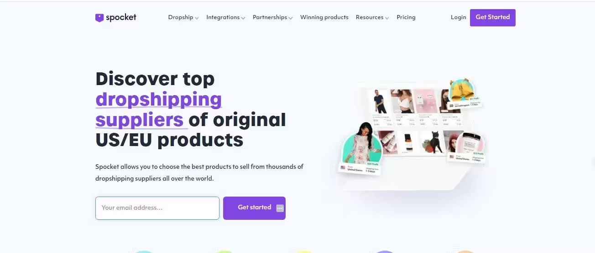

# 电商聚合平台到底是什么？一个普通人的观察笔记

---

你有没有试过这样：想买个东西，打开五六个网站比价格，看库存，然后脑子一团浆糊？我有过。后来我发现，有种叫**电商聚合平台**的东西，就是专门解决这个麻烦的。

简单说，它就像把所有商店搬到一个数字商场里。你不用到处跑，在一个地方就能比价格、查库存、下单。这篇文章就是想聊聊这个东西——它怎么运作的,对买家和卖家有什么好处,以及为什么它可能会改变我们网购的方式。

---

## 它怎么工作的

电商聚合平台的核心逻辑其实很直白：把一堆网店的商品信息收集起来，整理好，然后展示在一个平台上。你不用再打开十几个标签页，它替你做了这个活儿。

它们通常用两种方法收集数据：

- **网络爬虫**：这个听起来有点技术感，其实就是让程序自动去各个网站抓取商品描述、价格、库存这些信息。抓完之后整理一下，放到平台上给你看。像 👉 [ScraperAPI 这样的工具就是专门干这个的](https://www.scraperapi.com/?fp_ref=coupons)，能绕过各种反爬机制，效率还特别高。
  
- **和商家合作**：有些平台直接跟供应商谈合作。找到靠谱的批发商需要筛选、研究产品、算成本。像 Spocket、阿里巴巴、敦煌网、SaleHoo 这些平台提供了各种选择，Faire 和 Worldwide Brands 适合做细分市场。很多聚合平台跟商家合作，直接从他们那儿拉商品信息，数据更新快也更准。网络爬虫抓完数据后，平台会整理一遍，方便你验证供应商。理解最小起订量（MOQ）、运费、质量控制这些东西很关键。找对了方法，不管你是做电商、代发货还是零售，都能玩得转。

数据收集完，平台会统一格式，让你能轻松筛选对比。整个购物流程快了不少。

---

## 对买家和卖家的好处

电商聚合平台让购物变简单了——把各家商品放一起，方便你比价找优惠。对商家来说，这些平台能提高曝光度，拿到更多客户数据，覆盖面也更广，有助于提升销量和市场份额。

### 对买家来说

**购物流程简化了**

最大的好处就是省事儿。你不用在一堆网站之间来回跳，所有东西都在一个地方。想找最低价还是完美的产品，聚合平台帮你整合好了，浏览起来特别方便。

**比价更容易**

平台上能看到多个商家的同款商品，价格一目了然。哪家最便宜、哪家在打折、哪家有优惠活动，你一眼就能看出来，不会错过好价。

**产品发现更集中**

聚合平台让你能在一个地方浏览各种卖家的商品，不用离开平台。不管是找小众产品还是热门爆款，都整理得清清楚楚，找东西效率高多了。

### 对商家来说

**曝光度和覆盖面提升**

把商品放到聚合平台上，就等于你的品牌能被更多人看见。中小企业可能没那么多预算打广告，但能借助平台现成的客户群，这是个很有效的引流方式。

**客户洞察**

聚合平台会收集大量消费者数据，你作为商家能拿到这些信息来改进产品。了解客户喜好、购物行为、流行趋势，能帮你调整选品和营销策略。

**销量和市场地位提升**

加入聚合平台后，你的商品被看到的机会多了，自然销量也会涨。平台本身就像一个数字市场，帮你导流量、促成交易。如果你还用个销售代表追踪工具，能监控业绩表现、优化外联、提高客户互动。

---

## 电商聚合平台的几种类型

电商聚合平台有不同形式，各自在网购生态里扮演不同角色。主要有这几种：

### 整合收购公司

这种公司会收购多家电商企业，整合到一个大框架下运营。它们通常专注于把被收购品牌的资源整合起来，建立更大、更高效的运营体系。目标是简化运营、降低成本、快速扩大规模。通过同时管理几个电商品牌，整合收购公司能利用规模经济，给消费者提供更丰富的商品选择。

成功的例子包括 **Thrasio** 和 **Win Brands Group**。这些公司通过收购成功的细分品牌、改进运营、扩大规模，在电商领域成了大玩家。对于想快速成长、扩大覆盖面的卖家来说，加入整合收购公司是个有效的发展路径。

### 比价购物平台

这类聚合平台专注于帮消费者比较各个网店的价格和商品。它们充当中间人，从多个零售商那儿收集商品数据，用统一格式展示出来。消费者可以按价格、类别或产品特征筛选，找到自己需要的东西。这种平台特别适合想确保买到最优价的人，或者喜欢浏览不同品牌但不想来回切换网站的人。

知名的比价购物平台包括 **Google Shopping**、**Shopzilla** 和 **PriceGrabber**。这些平台已经成了消费者比价、找促销、找折扣的首选资源。对商家来说，把商品放到比价购物平台上能提高曝光度，接触到一大群正在主动找商品的活跃用户。

---

## Spocket 在电商聚合中的角色

说到代发货和电商聚合，**Spocket** 扮演了一个挺关键的角色。它通过提供优质、快速发货的供应商（主要来自**美国**和**欧盟**），提升了整体购物体验。作为领先的代发货平台，**Spocket** 为商家提供了可靠的解决方案来采购高质量商品，这对于建立信任和提供优质客户体验至关重要。那 **Spocket** 在电商聚合世界里是怎么融入的呢？

### Spocket 是什么

**Spocket** 是一个代发货平台，连接创业者和供应商，提供高质量商品和更快的发货时间，供应商主要来自美国和欧盟。跟很多依赖海外供应商（比如**中国**）的平台不同，**Spocket** 确保商品从更近的地区采购，大幅缩短了发货时间，质量控制也更好。

### Spocket 在聚合中的作用

对电商聚合平台来说，**Spocket** 提供了竞争优势——不仅商品质量高，而且送达客户的速度更快。**Spocket 的整合**让聚合平台能提供更好的购物体验，减少了传统全球供应商常见的问题，比如发货时间长、产品质量不稳定。

**Spocket** 给电商聚合平台带来的价值包括：

- **获取优质商品**：使用 **Spocket** 的聚合平台能展示来自注重质量的供应商的优质商品，确保客户对购买的东西满意。
- **更快的发货**：聚焦于**美国**和**欧盟**供应商，**Spocket** 提供更短的配送时间，让电商聚合平台能承诺更快的商品交付，这是客户满意度的关键因素。
- **可靠的供应商网络**：**Spocket 的供应商**经过严格审核，确保聚合平台能信任它们展示的商品，减少退货和客户投诉的可能性。

### 对聚合平台的好处

- **商品种类更丰富**：**Spocket** 通过提供来自知名、可信供应商的各种商品，帮助聚合平台丰富产品线。
- **客户满意度更高**：更快、更可靠的发货让客户更满意，进而带来更好的评价、回头客和平台口碑提升。
- **整合更容易**：**Spocket** 能无缝整合到 Shopify 和 WooCommerce 这些热门平台上，方便电商聚合平台引入高质量商品、简化运营流程。

总的来说，👉 [**Spocket** 通过提升商品质量、加快配送、确保商品一致性，完美补充了电商聚合平台的功能](https://www.scraperapi.com/?fp_ref=coupons)。不管你是想给客户提供更好体验的代发货商，还是想在竞争激烈的市场中提供最佳商品的聚合平台，整合 **Spocket** 都是个正确的选择。

---

## 电商聚合平台面临的挑战

虽然电商聚合平台因为便利和高效越来越受欢迎,但它们在保持顺畅运营时也会遇到一些挑战。来看看这些平台常遇到的几个难题：

### 管理庞大的库存

电商聚合平台面临的主要挑战之一是管理来自众多供应商的海量库存。这些平台通常从多个零售商那儿拉商品数据，这意味着它们必须确保库存实时更新。这挺棘手的，特别是有些卖家经常改价格、更新库存或下架商品。聚合平台需要强大的系统快速同步这些更新，避免给消费者展示缺货或过时的商品。

另外，由于商品来自不同供应商，库存容易出现差异。如果某件商品显示有货但实际上缺货，客户会不满意。

### 确保商品质量一致

因为电商聚合平台经常依赖第三方供应商，保持商品质量一致可能是个挑战。不同供应商的质量标准各不相同，平台对商品没有直接控制权，很难确保宣传的东西和客户收到的东西一致。

要解决这个问题，聚合平台必须和可信供应商建立牢固关系，定期做质量检查。例如，**Spocket** 的整合能帮忙缓解这个问题——它提供来自**美国**和**欧盟**的可靠、高质量供应商，确保商品符合更高标准，发货也更快。

### 复杂的物流和配送

电商聚合平台面临的另一个挑战是管理物流，特别是当商品来自全球各地的不同供应商时。协调发货和配送时间可能很复杂，尤其是有些供应商在海外。聚合平台还得处理多个配送中心和第三方物流公司的复杂情况，这可能导致配送时间不一致、运费升高，甚至发货错误。

通过与 **Spocket** 这样的平台合作，聚合平台能简化物流——专注于配送时间更快的可靠供应商，最终提升客户体验。

### 来自大型市场的竞争

随着越来越多电商企业进入聚合平台领域，想脱颖而出越来越难。**亚马逊**、**eBay** 和 **沃尔玛** 这些大型市场已经是家喻户晓的名字，它们提供自己版本的聚合购物体验。跟这些行业巨头竞争很难，特别是对想从零开始建立客户群的新平台来说。

要在这个竞争激烈的环境中成功，聚合平台需要提供独特的价值主张，比如更快的配送、更好的商品质量或细分品类的商品选择。通过整合 **Spocket** 这样的平台，聚合平台能提供高质量、快速发货的商品，让自己从竞争中脱颖而出。

---

## 电商聚合的未来趋势

电商聚合的世界正在快速演变，我们可以期待几个令人兴奋的趋势来塑造它的未来。从先进技术整合到更关注可持续性，聚合平台的运营方式将发生变化。来看看未来几年可能主导这个领域的几个关键趋势。

### AI 和个性化

电商聚合中最重要的趋势之一是越来越多地使用**人工智能（AI）**来个性化购物体验。AI 让聚合平台能分析消费者行为、偏好和历史购买记录，提供量身定制的商品推荐。这不仅通过让找相关商品变得更容易来改善客户体验，还提升了转化率——因为个性化推荐更可能促成购买。

AI 驱动的个性化还能增强搜索功能，让客户更容易找到需要的东西，不用浏览长长的商品列表。整合 AI 工具来个性化平台的聚合平台，会更有能力吸引用户、提高客户满意度。

### 全球扩张

随着世界联系越来越紧密，**电商聚合平台**正在超越初始区域，扩张到新的全球市场。这个趋势是由不断增长的国际消费者数量和对多样化商品的需求推动的。

扩张到新市场会面临挑战，比如本地化物流和语言障碍，但也为聚合平台打开了开发服务不足地区的机会。通过提供来自当地供应商的商品，聚合平台还能缩短配送时间，让平台对这些新地区的客户更有吸引力。

像 **Spocket** 这样连接商家和**美国**、**欧盟**供应商的平台，对于想提供更快发货和更高质量商品的聚合平台特别重要，这能帮它们在国际扩张时获得竞争优势。

### 可持续性和道德采购

消费者越来越关注他们购买的商品对环境和社会的影响。因此，**可持续性**正成为电商聚合平台需要考虑的关键因素。越来越多聚合平台希望与专注于**道德采购**、环保材料和可持续制造实践的供应商合作。

这个趋势也是由监管压力和消费者对透明度的需求推动的。例如，**Spocket** 提供来自遵循道德和可持续实践的供应商的商品，这帮助聚合平台向客户推广这些价值观。专注于可持续性的聚合平台可能会被视为更值得信赖和负责任，吸引重视这些原则的客户。

### 语音和视觉搜索

随着**智能音箱**和 Alexa、Google Assistant 这些**语音助手**的使用越来越多，**语音搜索**正成为网购者的重要工具。同样，**视觉搜索**——消费者上传图片来找类似商品——已经成为热门功能,特别是在时尚和家居装饰领域。

电商聚合平台需要适应这些变化，在平台中整合**语音和视觉搜索功能**。这项技术让用户能通过说话或展示图片轻松找到商品，为喜欢免提、基于图像搜索体验的人提供了更多便利。

### 与订阅模式整合

订阅模式越来越受欢迎，特别是在美容、食品和时尚等行业。聚合平台可能会把这些模式整合到平台中，让消费者能注册定期配送他们喜欢或需要的商品。

通过提供订阅选项，聚合平台能培养客户忠诚度并产生经常性收入。这对提供护肤品、食品或家居用品等消耗品的商家特别有益。订阅服务为客户提供便利，为聚合平台提供稳定性，使这个趋势值得关注。

---

## 结语

电商聚合平台已经改变了我们网购的方式——集中化的商品发现、让消费者能比价、简化购买流程。它们带来的好处包括节省时间、更好的比价体验，以及给商家更多曝光机会。随着这些平台继续发展，预计会拥抱 AI、语音搜索和可持续性，塑造一个更个性化、更高效的购物体验。

通过整合像 **Spocket** 这样的解决方案，聚合平台能确保更高质量的商品、更快的发货，以及为客户提供无缝的购物旅程。随着电商格局演变，聚合平台将扮演越来越关键的角色，为买家和卖家提供竞争优势。
